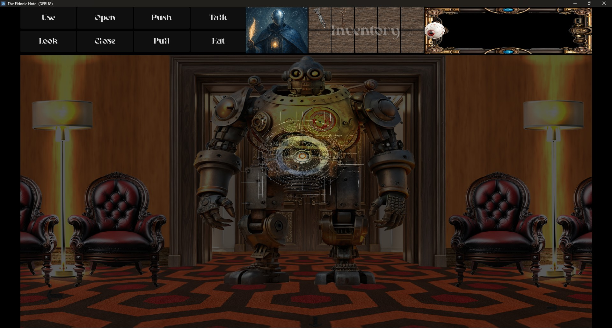
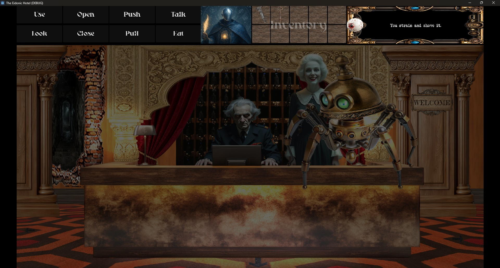
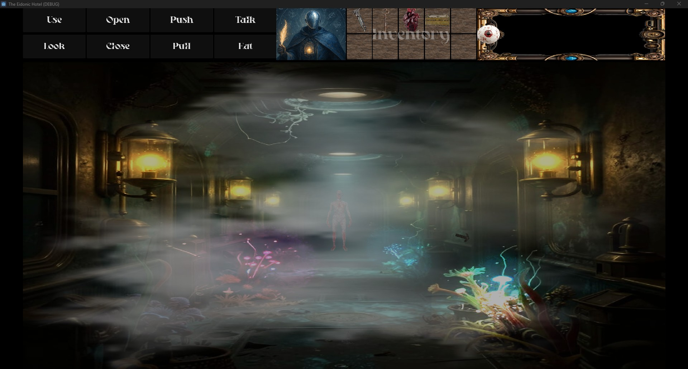
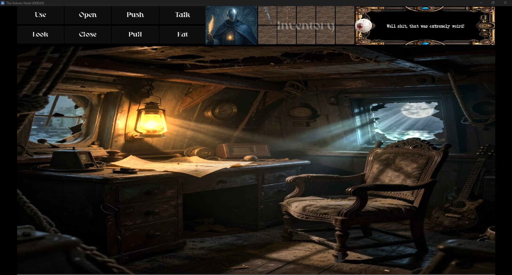
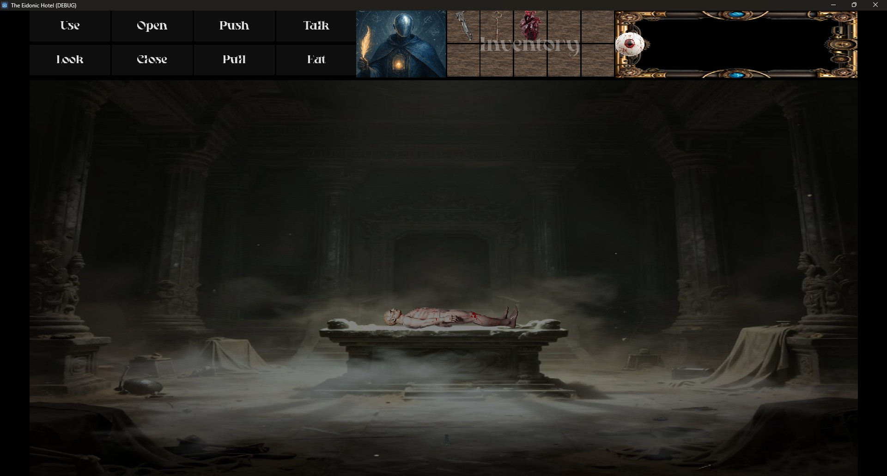
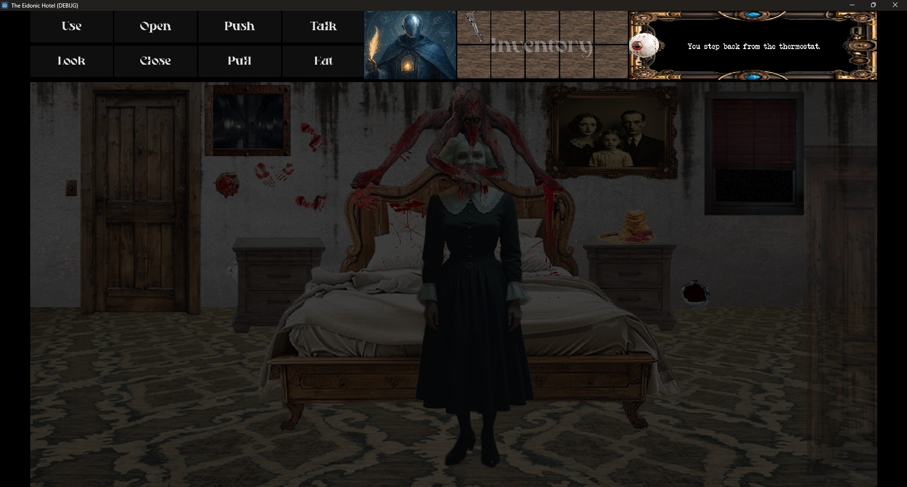
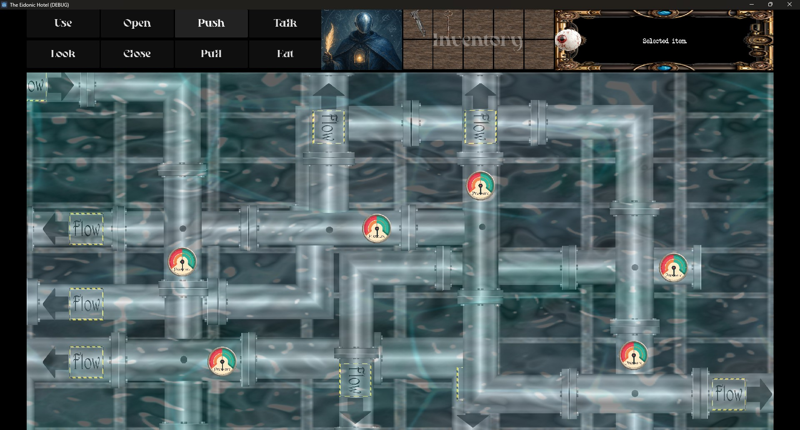
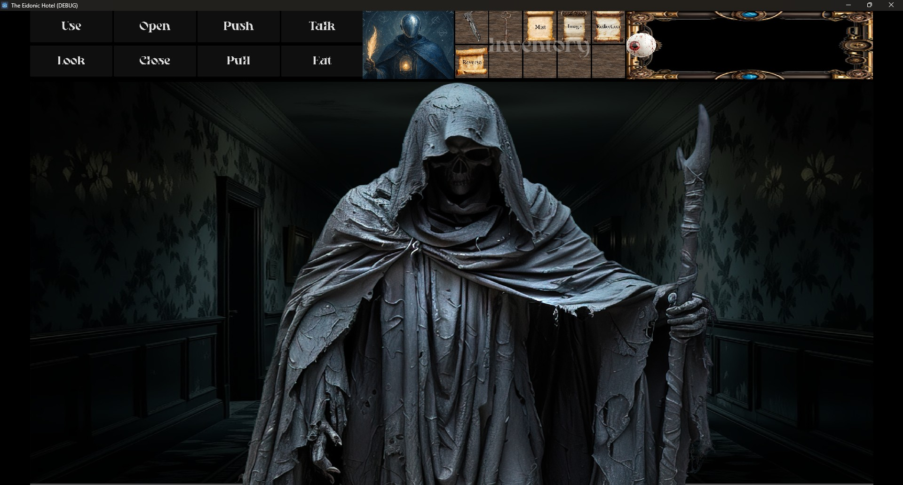
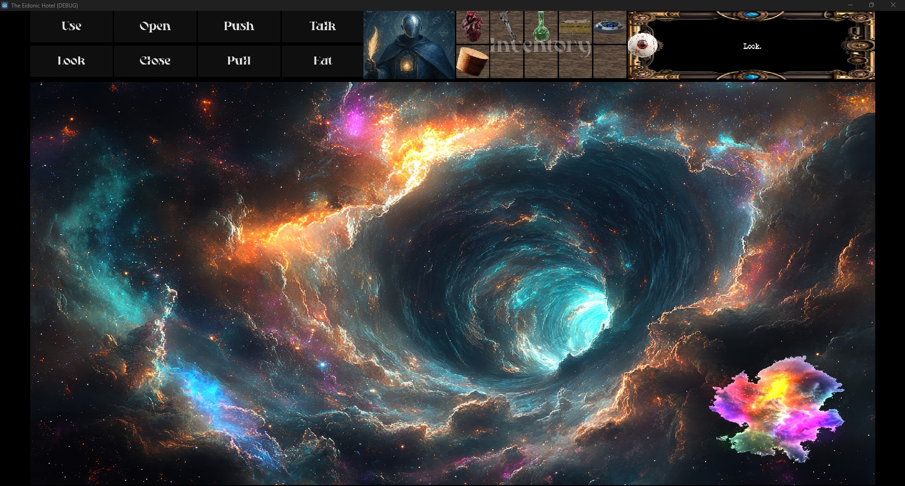
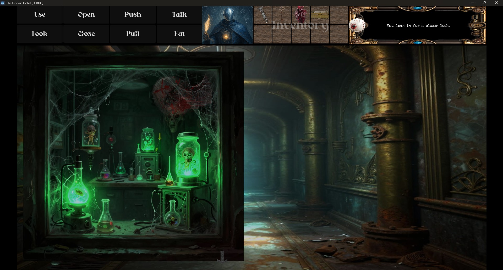

# Eidonic Hotel:  Visual Portfolio

**AI-Generated + Human-Refined Visual Assets for a Surreal Cosmic Horror Point-and-Click Game**

Every visual asset in **Eidonic Hotel** starts as generative AI and is refined through hundreds of iterations + Photoshop post-production to reach production quality. This portfolio demonstrates the exact skills xAI’s Image Tutor role requires: prompt iteration, visual critique, composition, lighting, color harmony, mood consistency, and turning raw generations into cohesive, intentional final art.

### My Visual Workflow
1. Generative base prompts focused on surreal horror tone and storytelling  
2. Critical iteration, analyzing composition, focal points, lighting, and color shifts  
3. Photoshop refinement, hand-detailing, contrast, fog, atmospheric effects  
4. Godot 4 integration testing, ensuring every asset supports gameplay and immersion  

### Selected Assets

  
**Hotel Entrance** Strong symmetrical composition with dramatic warm/cool lighting contrast. The central robot figure creates immediate unease while the ornate chairs ground the scene on that all to familiar carpet.

  
**Front Desk** Rich gold and red color palette with perfect atmospheric haze. The spider-like robot and elderly staff create a perfect uncanny welcome moment.

  
**Deep Hallway** Masterful use of volumetric fog and glowing bio-luminescent elements. The distant figure draws the eye deep into the scene while maintaining mystery.

  
**Captains Quarters** Beautiful dramatic god-ray lighting through broken windows. The warm lantern contrasts with cool moonlight, heightening the sense of isolation and decay.

  
**Altar Room** Powerful ritual composition with heavy volumetric fog and stone textures. The body on the slab creates instant narrative tension.

  
**First Room Demon Encounter** Excellent use of blood splatter and framing. The demonic figure over the woman delivers strong horror while keeping the scene readable.

  
**Pump House Puzzle** Clean mechanical UI with glowing pipes and gauges. Great example of functional + atmospheric puzzle design.

  
**Reaper** Striking character design with tattered cloak and dramatic hallway lighting. The scale and posture instantly communicate threat.

  
**Cosmic Entity** Epic swirling vortex with vibrant nebula colors. Perfect example of turning raw AI cosmic imagery into a focused, story-relevant vision.

  
**Lab Specimen Window** Creepy green bioluminescent glow against dark industrial pipes. Excellent contrast and detail work on the specimen jars.

### Tools & Process
- **Generation**: Grok / Custom GPTs / various other models / local models  
- **Refinement**: Adobe Photoshop (color grading, detail work, artifact removal)  
- **Engine**: Godot 4 (real-time testing of every asset)  

**Related Work**  
Eidonic Core (governed visual manifestation layers): https://github.com/Eidonic-Systems/eidonic-core
